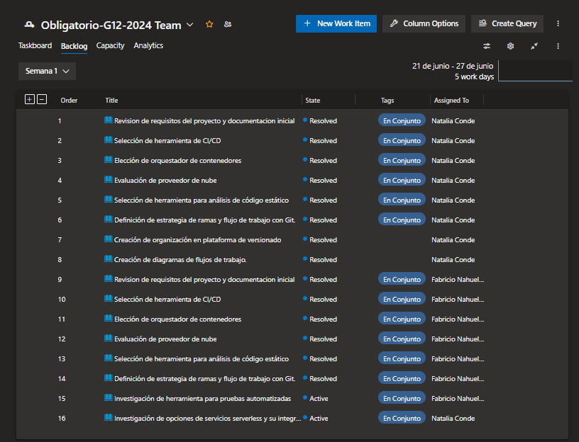
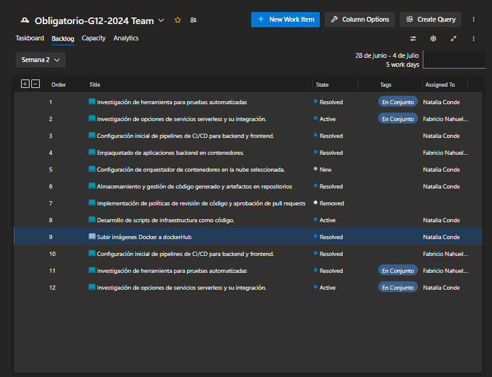
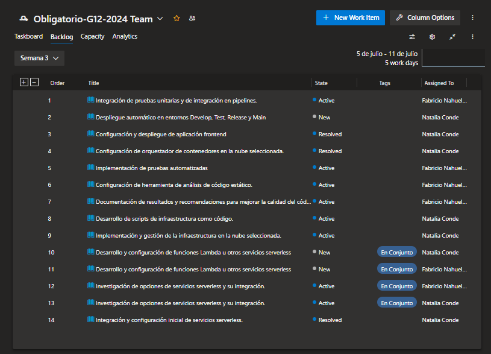
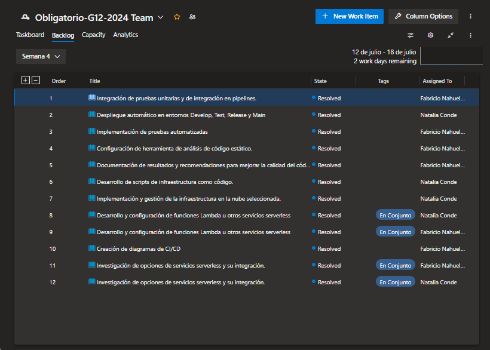

# Avance de tareas G12

Se ajuntan capturas de tablero Kanban y cambios para semana siguiente:

### Semana 1

Tareas comenzadas esta semana pero que se terminarán en la siguiente:
- *Investigacion de herrameintas para pruebas automatizadas* 

### Semana 2

Tareas comenzadas esta semana pero que se terminarán en la siguiente:
- *Investigacion de opciones de servicios serverless y su integración*
- *Desarrollo de scripts de infraestructura como codigo*
- *Subir imágenes a DockerHub*

Tareas sin comenzar que se pasan a la siguiente semana:
- *Configuracion de orquestador de contendores* (sin comenzar)

### Semana 3

Tareas comenzadas esta semana pero que se terminarán en la siguiente:
- *Integración de pruebas unitarias y de integración en pipelines.*
- *Implementación de pruebas automatizadas*
- *Configuración de herramienta de análisis de código estático.*
- *Documentación de resultados y recomendaciones para mejorar la calidad del código.*
- *Desarrollo de scripts de infraestructura como código.*
- *Implementación y gestión de la infraestructura en la nube seleccionada.*
- *Investigación de opciones de servicios serverless y su integración.*

Tareas sin comenzar que se pasan a la siguiente semana:
- *Despliegue automático en entornos Develop, Test, Release y Main*
- *Desarrollo y configuración de funciones Lambda u otros servicios serverless*
- *Integración y configuración inicial de servicios serverless.*

### Semana 4

