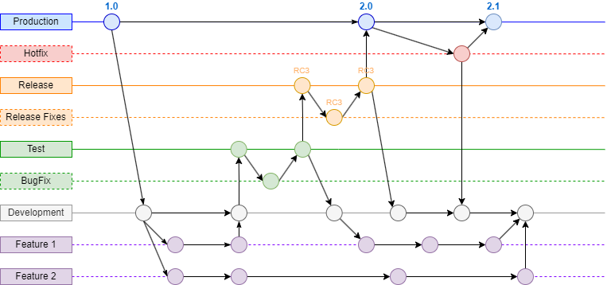
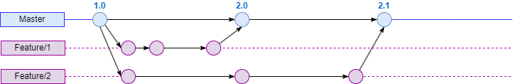
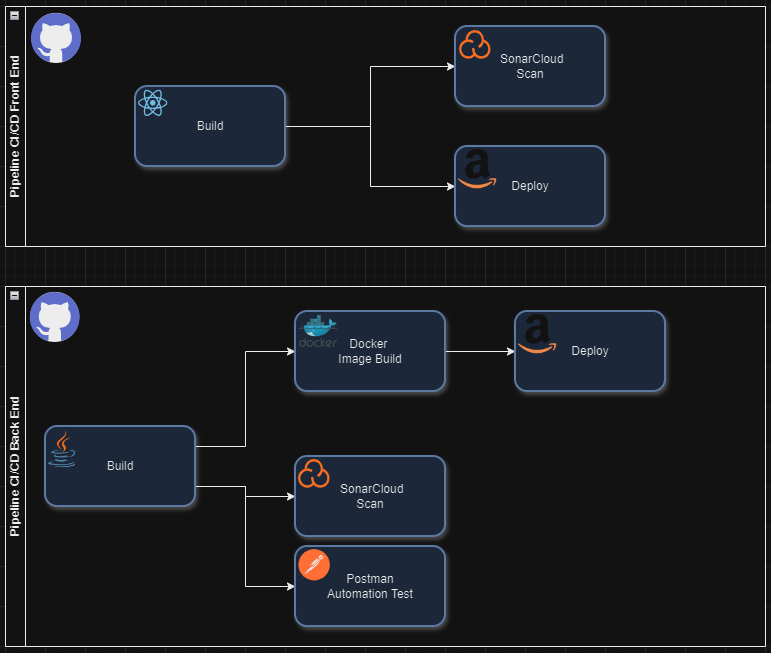
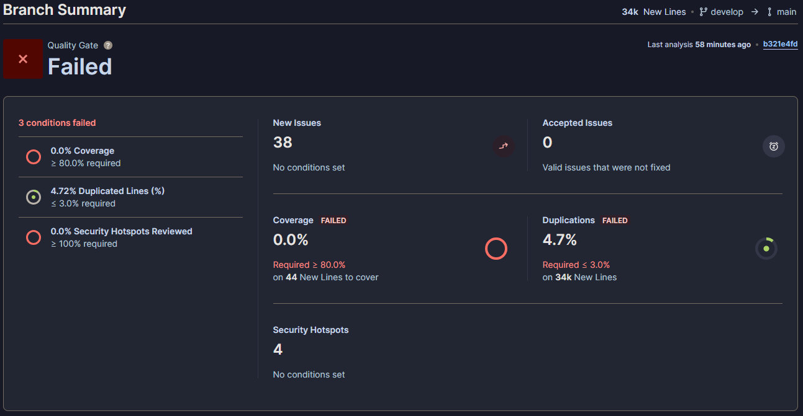
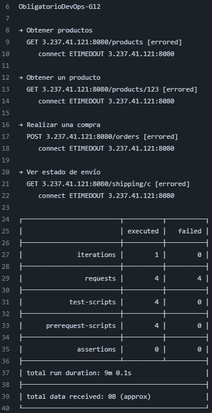
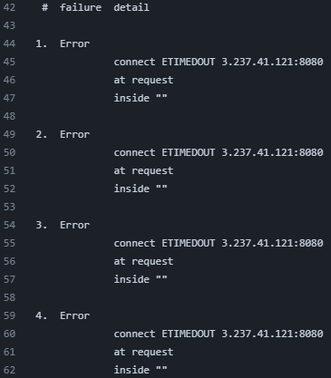
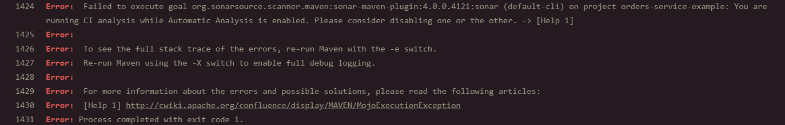

# Universidad ORT Uruguay Facultad de Ingeniería
## Proyecto DevOps - Transformación Digital en una Empresa de Retail

### Presentación del Problema
Durante la transformación digital de una empresa líder en retail, se identificó un desafío significativo relacionado con la comunicación y colaboración entre los equipos de desarrollo y operaciones. La implementación de una nueva aplicación destinada a revolucionar la experiencia de compra de los clientes reveló problemas recurrentes en los despliegues, causando errores y caídas del sistema que afectaron negativamente la experiencia del usuario y la reputación de la empresa.

El problema principal no era técnico, sino cultural. La tradicional separación entre los equipos de desarrollo y operaciones había creado un entorno donde la comunicación y la responsabilidad compartida eran deficientes. 

Para abordar estos desafíos, la dirección ejecutiva reconoció la necesidad de un cambio cultural que alineara a ambos equipos bajo objetivos comunes. Se solicitó un plan de acción que no solo mejorara las ineficiencias operativas, sino que también fomentara un ambiente de colaboración, transparencia y aprendizaje continuo.

### Objetivos
El objetivo principal de este proyecto es ensamblar y aplicar todas las prácticas, herramientas y metodologías aprendidas en el curso. Desglosando ese objetivo principal, el equipo se propone cumplir con los siguientes objetivos:

- **Implementar CI/CD:** Desarrollar un ciclo completo de integración y entrega continua que permita realizar despliegues automatizados y sin errores.
- **Desplegar la Infraestructura como Código (IaC):** Utilizar Terraform para definir y gestionar la infraestructura en la nube pública de AWS.
- **Emplear Contenedores Docker:** Empaquetar los microservicios en contenedores Docker y gestionarlos con AWS ECS.
- **Realizar Análisis de Código Estático y Pruebas Automáticas:** Integrar SonarCloud para el análisis de código estático y Postman para las pruebas funcionales dentro del pipeline de CI/CD.

A través de esta iniciativa, la empresa no solo espera superar los obstáculos actuales, sino también sentar las bases para una agilidad y resiliencia operativa a largo plazo, asegurando así su posición competitiva en el mercado.

### Solución Propuesta
Para abordar los problemas identificados y cumplir con los objetivos planteados, se propone la siguiente solución integral que combina prácticas culturales y técnicas:

#### Flujo de Trabajo
Para gestionar el versionado del proyecto, hemos implementado flujos de trabajo diferenciando para la parte de desarrollo y DevOps., adaptados a las necesidades de cada etapa del proyecto: Gitflow para el desarrollo y Trunk-Based para DevOps.

##### - Gitflow para Desarrollo
Se utiliza GitFlow como estrategia de versionado para los proyectos de desarrollo, ya que facilita la gestión eficiente del flujo de trabajo colaborativo. GitFlow es una metodología que permite estructurar el desarrollo en ramas distintas (develop, test, release y main) para representar los diferentes ambientes del ciclo de desarrollo. Esto hace más sencillo dividir las responsabilidades entre los equipos de desarrollo y operaciones.

Al mantener el desarrollo continuo en la rama develop y las versiones estables en main, esta metodología garantiza una gestión eficaz del versionado que minimiza los riesgos y conflictos en el código base. Adicionalmente, se pueden realizar correcciones específicas en diferentes entornos si se detectan errores, utilizando ramas auxiliares para cada corrección. Esto ayuda a mejorar la estabilidad y mantenibilidad del software.

###### Ramas Principales (ramas estables)
- **Main**: Contiene el código de producción.
- **Release**: Contiene el código preparado para pasar a producción.
- **Test**: Contiene el código para pruebas integrales antes de ser liberado.
- **Develop**: Contiene el código para la próxima versión que está en desarrollo.

###### Ramas de Soporte (ramas auxiliares)
- **HotFix**: Ramas para corregir errores críticos en producción.
- **ReleaseFix**: Ramas para corregir errores en las versiones preparadas en la rama Release.
- **BugFix**: Ramas para corregir errores encontrados durante la relaización de pruebas.
- **Feature**: Ramas para desarrollar nuevas características.

##### - Trunk-Based para DevOps
Con el objetivo de mejorar la colaboración en tiempo real y aumentar la eficiencia en la creación y mantenimiento de nuestra documentación técnica y operativa, hemos decidido implementar Trunk Based Development como parte de nuestro proceso DevOps.

Con este enfoque, podemos colaborar de forma continua y actualizar documentos al instante para garantizar que todos los miembros del equipo estén trabajando con las versiones más actualizadas y aprobadas. Implementar esta práctica disminuye las complicaciones y diferencias ocasionadas por diversas versiones del documento, además de agilizar los procesos para recibir rápidamente feedback que permita detectar errores o determinar mejoras necesarias.

La mejoría de la visibilidad y auditabilidad de la documentación también se logra mediante Trunk Based Development, ya que este enfoque proporciona una única fuente confiable que refleja fielmente el estado actual y los cambios a lo largo del proyecto.

###### Ramas Principales
- **main**: Rama que contiene la ultima version de los documentos

###### Ramas de Soporte (ramas auxiliares)
- **feature**: Rama para trabajar los diferentes documentos del proceso DevOps.

#### Herramientas y Tecnologías Utilizadas
1. GitHub: Plataforma para alojar repositorios del código, configuraciones y documentación.
2. GitHub Actions: Herramienta para implementar estrategias de CI/CD.
3. Docker: Tecnología para la creación y gestión de contenedores.
4. Docker Hub: Registro Docker para alojar las imágenes de los contenedores.
5. Terraform: Para definir la infraestructura como código.
6. AWS ECS: Servicio de orquestación de contenedores.
7. SonarCloud: Servicio para análisis de código estático.
8. Postman/Newman: Herramientas para realizar pruebas funcionales del código.
9. AWS Lambda: Para realizar backups automáticos de las aplicaciones de backend.
10. Visual Studio Code: Entorno local de desarrollo.

#### Infraestructura
Toda la infraestructura será desplegada como código (IaC) utilizando Terraform. La infraestructura se compondrá de la siguiente manera:

- VPC con dos zonas de disponibilidad.
- Cluster ECS en AWS
- Microservicios desplegados en contenedores Docker y gestionados por ECS.
- Bucket de S3, donde se alojará la aplicación frontend.

#### Implementación de CI/CD

##### Pipeline de CI (Integración Continua):

- Construcción del Código: Compilación y empaquetado del código fuente.
- Análisis de Código Estático: Utilización de SonarCloud para detectar errores y vulnerabilidades.
- Pruebas Funcionales: Ejecución de pruebas funcionales con Newman/Postman.
- Publicación de Artefactos: Publicación de los resultados de la compilación y pruebas como artefactos en GitHub.

##### Pipeline de CD (Entrega Continua):

- Construcción de Imágenes Docker: Construcción de las imágenes Docker a partir del código fuente y publicación en Docker Hub (solo para microservicios).
- Despliegue en AWS ECS: Despliegue de las aplicaciones backend en el cluster ECS.
- Despliegue en S3: Publicación de la aplicación frontend en un bucket de S3.
- Monitoreo y Notificaciones: Monitoreo del estado del despliegue y notificaciones sobre el estado de las implementaciones.

##### Reportes

**Reporte de SonarCloud:**

- Microservicio "Products": No pasó,
- Microservicio "Payments": [Pasó o no pasó, como?]
- Microservicio "Shipping": [Pasó o no pasó, como?]

Los resultados detallados de SonarCloud se pueden visualizar en las siguientes capturas de pantalla:

- *Reporte de SonarCloud - Products*

- *Reporte de SonarCloud - Payments*

- *Reporte de SonarCloud - Shipping*

- *Reporte de SonarCloud - Fronted*

**Reporte de Pruebas Funcionales:**

- Microservicio Orders: [Pasó o no pasó, como?]
- Microservicio Payments: [Pasó o no pasó, como?]
- Microservicio Shipping: [Pasó o no pasó, como?]

Los resultados detallados de las pruebas funcionales se pueden visualizar en los siguientes enlaces (o capturas?):

- *Reporte de Pruebas Funcionales (Sobre las aplicaciones de Backend)*

#### Gestión del Proyecto y Limitaciones
Para la gestión del proyecto se utilizó un tablero Kanban en Azure Devops, donde se detallaron todas las tareas y se realizó el seguimiento del progreso.

- Limitaciones 

    - Manejo feature/branch 

Aunque GitHub fue uno de los temas tratados y trabajados en clase, el equipo no estaba familiarizado con esta herramienta. Esto complicó un poco el uso de la estrategia feature/branch durante el proyecto. A medida que avanzamos, nuestra experiencia creció, pero no fue suficiente para lograr un funcionamiento fluido en el tiempo disponible para la ejecución del proyecto.

    - CloudFront no disponible para cuentas AWS Academy

Al inicio del proyecto, se optó por utilizar CloudFront como servicio serverless. Sin embargo, durante la implementación, se nos informó que este servicio ya no estaba habilitado para cuentas académicas de AWS. Esto obligó a dedicar tiempo adicional en fases avanzadas del proyecto para investigar y adoptar otros servicios serverless.

    - SonarCloud Orders

No se pudo realizar el análisis de código estático para el microservicio "Orders" debido a un error generado durante la implementación de SonarCloud en ese repositorio. Aunque consultamos en una de las tutorías, no logramos una solución. Dado que en el resto de los repositorios la implementación de SonarCloud fue exitosa, descartamos que se tratara de un error de configuración, ya que se siguió el mismo procedimiento para todos. Por lo tanto, decidimos no ejecutar el análisis para este microservicio en particular. A continuación se deja captura del error obtenido:

    - Modularización Terraform

Reconocemos que la modularización en Terraform es una buena práctica. Sin embargo, priorizamos la funcionalidad de las configuraciones de Terraform y no tuvimos tiempo suficiente para modularizar y optimizar nuestra infraestructura como código (IaC). Continuaremos trabajando para lograr esta mejora en el futuro.

#### Documentación
Toda la documentación del proyecto se realizó en Markdown y se encuentra alojada en los repositorios correspondientes en GitHub. Esta incluye diagramas, descripciones de la infraestructura, archivos de configuración y capturas varias.

#### Conclusión
A través de este proyecto, se logró implementar una solución DevOps que mejora la colaboración entre los equipos de desarrollo y operaciones, optimiza el flujo de trabajo y asegura que la calidad del software se mantenga a través de prácticas CI/CD y pruebas automatizadas. El objetivo de la compañía no sólo es vencer los desafíos actuales, sino también establecer una base para futuros avances y robustez operativa.
